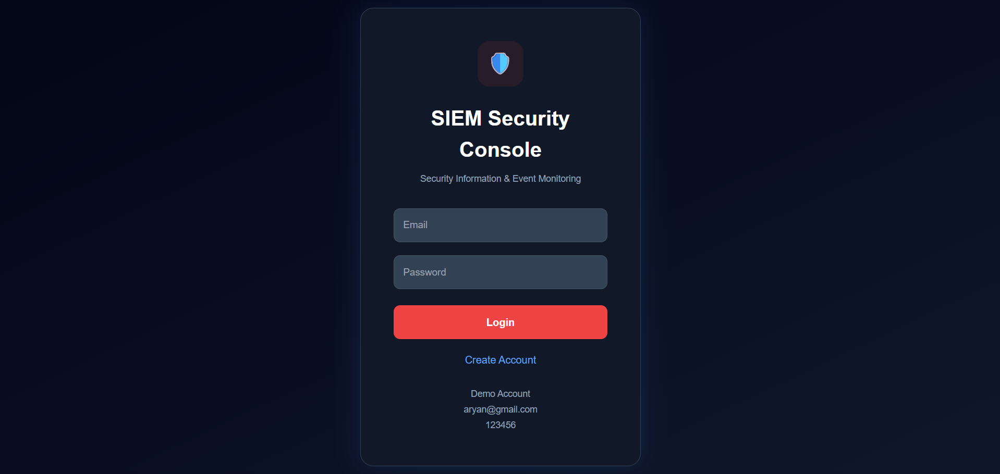
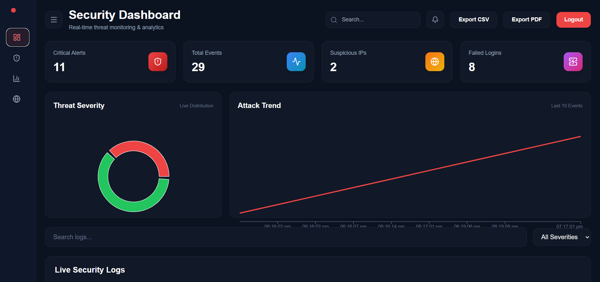
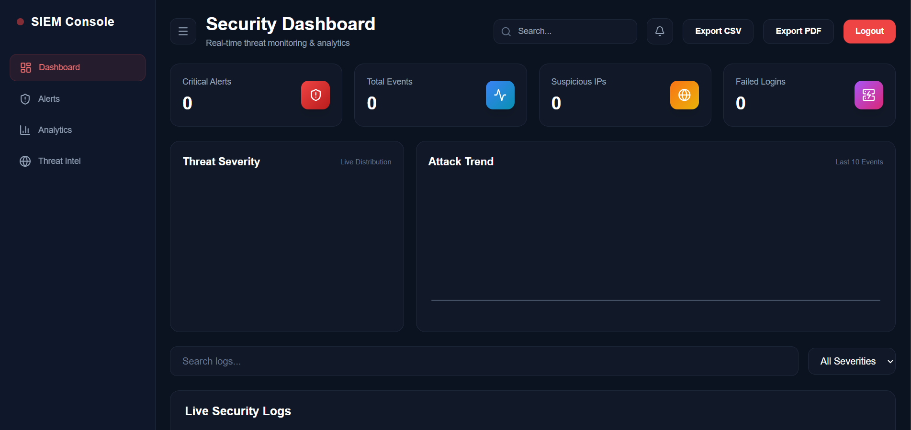
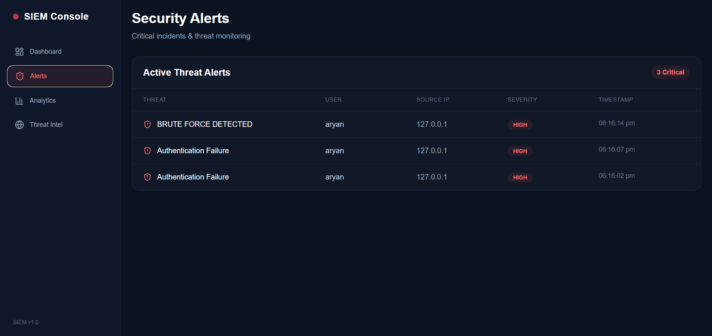
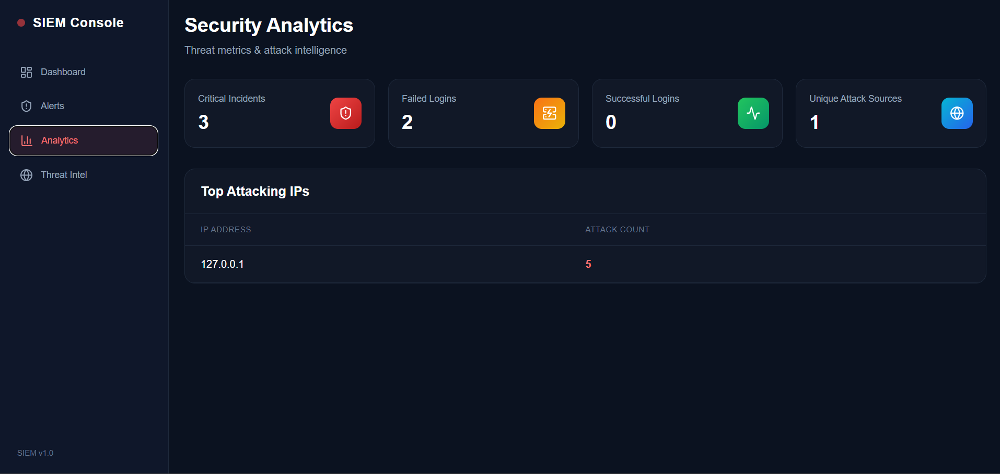
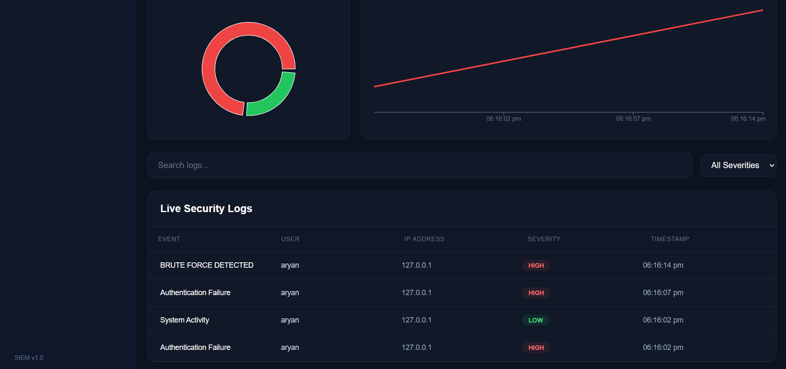
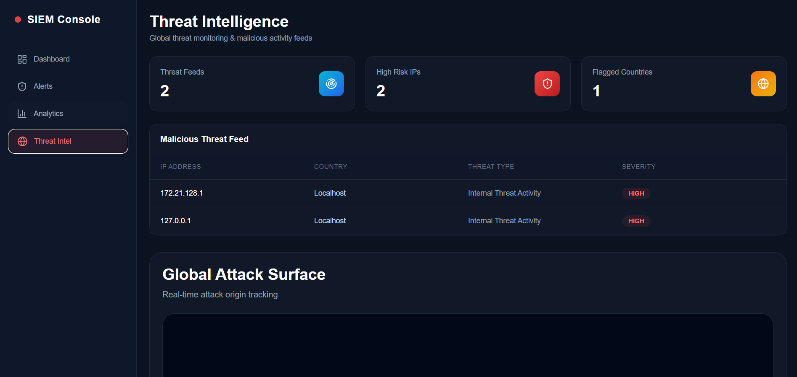
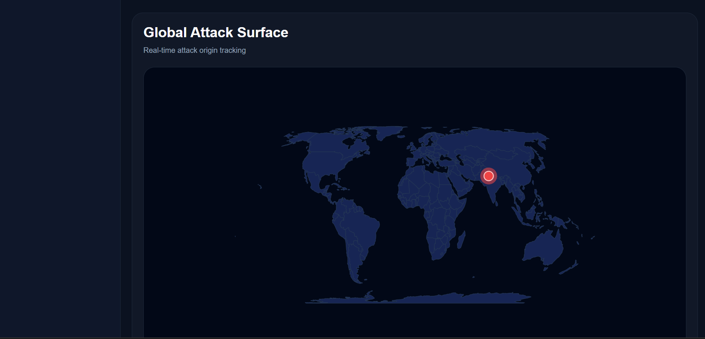
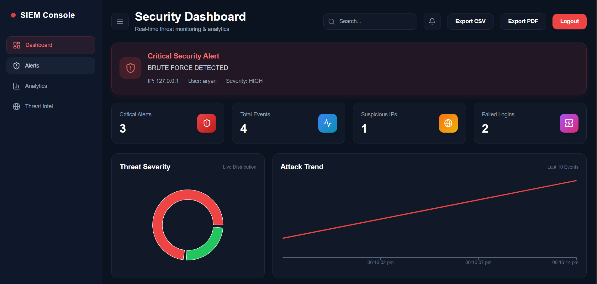

# SIEM Security Console

A full-stack Security Information and Event Management (SIEM) platform built using React, Node.js, Express, MongoDB, and Socket.IO for real-time security monitoring and threat detection.

The system monitors Linux authentication logs, detects suspicious activities such as authentication failures and brute-force attempts, and provides an interactive dashboard for security analytics and threat intelligence.

---

## Features

### Authentication & User Management

* User Registration
* Secure Login
* JWT Authentication
* Protected API Endpoints
* Logout Functionality

### Security Dashboard

* Real-time Security Monitoring
* Critical Alert Tracking
* Event Statistics
* Suspicious IP Detection
* Failed Login Monitoring

### Security Alerts

* Authentication Failure Detection
* Brute Force Detection
* Severity Classification
* High-Risk Event Monitoring

### Security Analytics

* Threat Severity Distribution
* Attack Trend Visualization
* Failed Login Analytics
* Successful Login Analytics
* Top Attacking IP Addresses

### Threat Intelligence

* Threat Feed Generation
* High Risk IP Tracking
* Flagged Country Detection
* Global Attack Surface Visualization

### Reporting

* Export Security Logs to CSV
* Export Security Reports to PDF

---

## Technology Stack

### Frontend

* React.js
* Tailwind CSS
* Recharts
* React Simple Maps
* Socket.IO Client
* Lucide React

### Backend

* Node.js
* Express.js
* MongoDB
* Mongoose
* JWT Authentication
* Socket.IO

### Security Monitoring

* Linux Authentication Logs (`/var/log/auth.log`)
* Threat Detection Engine
* Brute Force Identification
* Security Event Correlation

---

## Screenshots

### Login Page



---

### Security Dashboard



---

### Security Dashboard (No Logs)



---

### Security Alerts



---

### Security Analytics



---

### Live Security Logs



---

### Threat Intelligence



---

### Global Attack Surface



---

### Brute Force Detection



---

## Project Structure

```text
siem-project/
│
├── backend/
│   ├── middleware/
│   ├── models/
│   ├── routes/
│   ├── server.js
│   ├── .env.example
│   └── package.json
│
├── frontend/
│   ├── src/
│   ├── public/
│   ├── .env.example
│   └── package.json
│
├── screenshots/
│
└── README.md
```

---

## Requirements

Before running the project, install:

* Node.js 18+
* npm
* MongoDB Atlas Account
* Ubuntu / Linux / WSL (Recommended)

---

## Installation

### Clone Repository

```bash
git clone https://github.com/aryanpatanwal/siem-security-console.git

cd siem-security-console
```

---

### Backend Setup

Navigate to backend:

```bash
cd backend

npm install
```

Create a `.env` file:

```env
PORT=5000

MONGO_URI=your_mongodb_connection_string

JWT_SECRET=your_secret_key
```

Start backend:

```bash
npm start
```

---

### Frontend Setup

Navigate to frontend:

```bash
cd frontend

npm install
```

Create a `.env` file:

```env
REACT_APP_API_URL=http://localhost:5000
```

Start frontend:

```bash
npm start
```

---

## Usage

### Create Account

Register a new account using:

* Username
* Email
* Password

### Login

Authenticate using your registered credentials.

### Monitor Security Events

After logging in you can:

* View Security Dashboard
* Review Security Alerts
* Analyze Attack Trends
* Monitor Threat Intelligence
* Export Reports

---

## Security Features

### Authentication Failure Detection

Detects failed login attempts from Linux authentication logs.

### Brute Force Detection

Identifies repeated authentication failures and raises alerts.

### Threat Intelligence

Maps suspicious activity to threat feeds and attack origins.

### JWT Security

Protects API endpoints using JSON Web Tokens.

---

## Important Note

This project is designed to monitor Linux authentication logs.

Primary log source:

```text
/var/log/auth.log
```

For full functionality run the backend on:

* Ubuntu
* Debian
* Linux Mint
* Kali Linux
* WSL (Windows Subsystem for Linux)

Windows users can run the dashboard interface, but log collection may require modification to read Windows Event Logs.

---

## Future Improvements

* GeoIP Integration
* Email Alerting
* Role-Based Access Control (RBAC)
* Multi-Host Monitoring
* Threat Feed API Integration
* Docker Deployment
* Cloud Deployment

---

## Author

Aryan

Cybersecurity Project

---

## License

This project is intended for educational and portfolio purposes.
